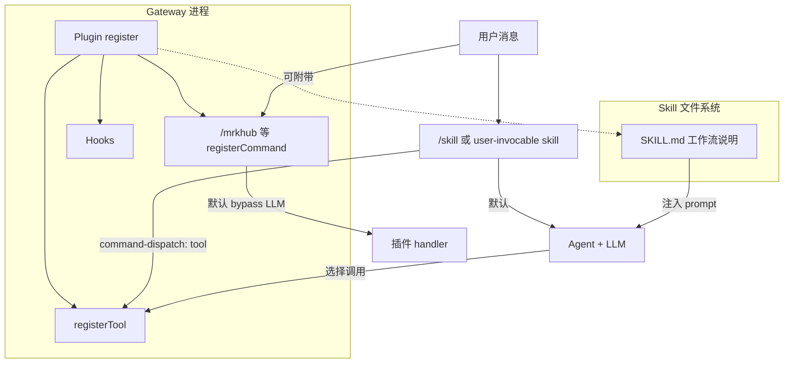

# OpenClaw 插件开发指南

> 整理依据：[Plugins](https://docs.openclaw.ai/tools/plugin/)、[Building plugins](https://documentation.openclaw.ai/plugins/building-plugins)、[Plugin architecture](https://documentation.openclaw.ai/plugins/architecture)、[Plugin SDK overview](https://documentation.openclaw.ai/plugins/sdk-overview)、[Plugin manifest](https://documentation.openclaw.ai/plugins/manifest)、[Slash commands](https://documentation.openclaw.ai/tools/slash-commands)、[Skills](https://documentation.openclaw.ai/tools/skills)、[Plugins CLI](https://docs.openclaw.ai/cli/plugins) 及 [openclaw/openclaw](https://github.com/openclaw/openclaw) 仓库说明。  
> 文档日期：2026-05-19

---

## 目录

1. [插件是什么：定义、作用、与 Tool / Skill 的区别](#1-插件是什么定义作用与-tool--skill-的区别)
2. [工作原理与执行机制](#2-工作原理与执行机制)
3. [如何开发一个插件](#3-如何开发一个插件)
4. [扩展知识：常见盲区与最佳实践](#4-扩展知识常见盲区与最佳实践)
5. [参考链接](#5-参考链接)

---

## 1. 插件是什么：定义、作用、与 Tool / Skill 的区别

### 1.1 定义

**OpenClaw 插件（Native Plugin）** 是一段在 **Gateway 进程内** 加载运行的 TypeScript/JavaScript 模块，通过官方 **Plugin SDK**（`openclaw/plugin-sdk/*`）向核心注册能力，从而 **在不改 OpenClaw 主仓库** 的前提下扩展系统行为。

每个原生插件必须包含：

| 文件 | 作用 |
|------|------|
| `openclaw.plugin.json` | 清单：id、配置 JSON Schema、`contracts` 所有权声明等；**可在不执行插件代码的情况下** 做配置校验 |
| `package.json` 中的 `openclaw.extensions` | 指向运行时入口（发布版应为编译后的 `.js`） |
| 入口模块 | 使用 `definePluginEntry` / `defineChannelPluginEntry`，在 `register(api)` 中注册能力 |

此外还有 **Compatible Bundle**（Codex / Claude / Cursor 插件布局），由 OpenClaw 映射进插件清单，**不是** 本文重点的原生插件形态。

### 1.2 插件能做什么

官方将插件能力归纳为多种 **Capability** 与 **非 Capability 表面**：

| 类型 | 注册 API（示例） | 典型用途 |
|------|------------------|----------|
| 文本推理 Provider | `api.registerProvider` | 新 LLM 供应商 |
| Channel | `api.registerChannel` | Discord、Matrix 等消息渠道 |
| Agent Tool | `api.registerTool` | 模型可调用的函数 |
| 斜杠命令 | `api.registerCommand` | **绕过 LLM** 的确定性命令 |
| Hook | `api.on(...)` | 拦截/改写 prompt、工具调用、消息流 |
| CLI 子命令 | `api.registerCli` | `openclaw xxx` 扩展 |
| HTTP 路由 / Gateway RPC | `api.registerHttpRoute` / `registerGatewayMethod` | 对外 API |
| 后台服务 | `api.registerService` | 长驻任务 |
| 会话扩展 | `api.session.state.registerSessionExtension` | 插件自有会话 JSON 状态 |

插件还可 **附带 Skills 目录**（在 manifest 中声明 `skills` 路径），随插件启用一并加载。

### 1.3 与 Tool（工具）的区别

| 维度 | **Plugin** | **Tool（Agent Tool）** |
|------|------------|------------------------|
| 本质 | 扩展包 / 运行时模块 | 模型在对话中 **可选择调用** 的一项能力 |
| 关系 | 插件 **注册** 工具；工具是插件的一种产物 | 由 `api.registerTool` 或核心内置提供 |
| 执行者 | 插件代码 `execute()` | 策略与 allowlist 通过后，由 Agent 运行时调用 |
| 配置 | `plugins.entries.<id>` + `contracts.tools` | `tools.allow` / 可选工具 opt-in |
| 典型场景 | 渠道、Provider、安装器、策略 Hook | 查天气、搜网页、执行工作流 |

要点：

- **没有插件也可以有工具**（核心内置工具）。
- **有工具不一定需要独立发插件**（最小形态可以是仅 `registerTool` 的 tool plugin）。
- manifest 中 `contracts.tools` 必须与 `registerTool` 名称一致，用于 **发现所有权**，且可在未加载完整 runtime 时被索引。

### 1.4 与 Skill 的区别

| 维度 | **Plugin** | **Skill** |
|------|------------|-----------|
| 形态 | TS/JS 模块 + manifest | 目录 + `SKILL.md`（YAML frontmatter + 说明文档） |
| 执行 | 代码在 Gateway 进程内运行 | **默认作为 prompt 指导** 交给模型阅读执行 |
| 加载 | `openclaw plugins install` / `plugins.load.paths` | `~/.agents/skills`、`workspace/skills` 等多层路径 |
| 分发 | npm、git、ClawHub、本地路径 | ClawHub、`openclaw skills install`、自建 Git 仓库 |
| 斜杠命令 | `api.registerCommand` → **默认不走模型** | `user-invocable: true` → 可暴露为 `/xxx`，**默认转发给模型** |
| 确定性逻辑 | handler / tool 内写死 | 可设 `command-dispatch: tool` 直连工具（仍需底层工具存在） |

**记忆口诀：**

- **Skill = 教模型怎么做**（说明书）。
- **Tool = 模型可以调用的手**（函数）。
- **Plugin = 往 Gateway 里装零件的机箱**（可装 Skill 目录、Tool、命令、渠道、Provider、Hook）。

### 1.5 三者协作示意



---

## 2. 工作原理与执行机制

### 2.1 四层架构（官方模型）

OpenClaw 插件系统分为四层（见 [Plugin architecture](https://documentation.openclaw.ai/plugins/architecture)）：

```text
1. Manifest + Discovery   → 发现候选插件（路径、bundled、workspace）
2. Enablement + Validation → 是否启用、allow/deny、独占 slot（如 memory）
3. Runtime Loading        → 进程内 require 加载，执行 register(api)
4. Surface Consumption    → 对话、CLI、渠道、Provider 消费注册表
```

**关键设计边界：**

- **清单校验** 不应依赖执行插件代码。
- **运行时行为** 只来自 `register(api)`，且 `api.registrationMode === "full"` 时为完整注册。
- Gateway 启动会构建 **元数据快照**（PluginMetadataSnapshot），供配置校验与所有权判断；**不等于** 已加载的模块实例。

### 2.2 安装与启用流程

```text
openclaw plugins install <spec>
    → 解析来源（clawhub / npm / git / 本地路径）
    → 安全扫描、写入 ~/.openclaw/extensions/<id>（或配置指定根）
    → 更新 install record

openclaw plugins enable <id>
    → 写 openclaw.json plugins.entries.<id>.enabled

openclaw gateway restart（或托管 Gateway 自动重启）
    → 冷启动加载 registry
    → 对 enabled 插件执行 register(api)
```

安装来源示例（[Plugins CLI](https://docs.openclaw.ai/cli/plugins)）：

```bash
openclaw plugins install clawhub:my-plugin
openclaw plugins install npm:@scope/pkg
openclaw plugins install git:github.com/owner/repo@main
openclaw plugins install ./my-plugin
openclaw plugins install --link ./my-plugin   # 开发时链到源码
```

### 2.3 斜杠命令执行路径

所有 `/...` 命令由 **Gateway** 统一处理（[Slash commands](https://documentation.openclaw.ai/tools/slash-commands)）：

| 来源 | 说明 |
|------|------|
| 核心内置 | `/new`、`/model`、`/status` 等 |
| 渠道插件 | `/dock-discord` 等 |
| 捆绑插件 | `/pair`、`/dreaming` 等 |
| **插件 `registerCommand`** | 自定义命令，**默认 bypass LLM** |
| **Skill `user-invocable`** | 暴露为斜杠命令，**默认当普通消息进 Agent** |

插件命令 handler 签名（概念上）：

```typescript
api.registerCommand({
  name: "my_cmd",
  description: "...",
  acceptsArgs: true,
  handler: async (ctx) => {
    // ctx.args, ctx.sessionKey, ctx.config, ...
    return { text: "回复内容", continueAgent?: true };
  },
});
```

- 返回 `continueAgent: true` 时，handler 处理完后 **可把剩余上下文交给 Agent**。
- `openclaw.json` 的 `commands` 块 **只控制内置命令开关**，**不能** 凭空新增命令名。

### 2.4 Agent Tool 执行路径

```text
构建本轮可用工具列表
    → 合并核心工具 + 已启用插件工具
    → 应用 plugins.allow / tools.allow / optional 元数据
    → 模型决定是否调用
    → before_tool_call 等 Hook 可拦截/要求审批
    → 插件 tool.execute(toolCallId, params, signal)
    → 结果回注模型（可经 tool-result middleware）
```

可选工具需同时在 manifest 与配置中 opt-in：

```json5
// openclaw.plugin.json
{ "contracts": { "tools": ["my_tool"] }, "toolMetadata": { "my_tool": { "optional": true } } }

// openclaw.json
{ "tools": { "allow": ["my_tool"] } }
```

### 2.5 Skill 加载与斜杠暴露

Skill 加载优先级（高 → 低，见 [Skills](https://documentation.openclaw.ai/tools/skills)）：

1. `<workspace>/skills`
2. `<workspace>/.agents/skills`
3. `~/.agents/skills`
4. `~/.openclaw/skills`
5. 安装包内置 skills
6. `skills.load.extraDirs` / **插件附带 skills 目录**

`user-invocable: true` 的 skill 可注册为斜杠命令；可选：

```yaml
command-dispatch: tool
command-tool: <tool_name>
```

### 2.6 插件形态（Shape）

`openclaw plugins inspect <id>` 会显示插件 **shape**，便于诊断：

| Shape | 含义 |
|-------|------|
| `plain-capability` | 仅一种 capability（如纯 Provider） |
| `hybrid-capability` | 多种 capability |
| `hook-only` | 仅 Hook，无 tool/command |
| `non-capability` | 有 tool/command/service，无 provider/channel 等 |

### 2.7 配置策略要点

```json5
{
  plugins: {
    enabled: true,
    allow: ["my-plugin"],           // 非空时为白名单，优先级高
    deny: ["untrusted"],            // 覆盖 allow
    load: { paths: ["~/dev/plugin"] },
    slots: { memory: "memory-core" }, // 独占类 slot
    entries: {
      "my-plugin": {
        enabled: true,
        config: { /* 由 manifest configSchema 校验 */ },
      },
    },
  },
}
```

规则摘要：

- `plugins.deny` **优先于** allow 与单插件 `enabled`。
- `plugins.allow` 非空时，未列入的插件 **无法加载**。
- 安装/更新/卸载插件代码后通常需要 **Gateway 重启**；enable/disable 可热更新部分表面，但 **`inspect --runtime` 才是 live 证明**。

---

## 3. 如何开发一个插件

### 3.1 环境要求

- **Node.js** ≥ 22.19
- **TypeScript ESM**（`"type": "module"`）
- 包管理器：npm 或 pnpm
- 本机安装 OpenClaw CLI（或项目 `devDependencies` 内 `openclaw`，用 `pnpm exec openclaw`）

### 3.2 选型：做什么样的插件

| 目标 | 推荐形态 |
|------|----------|
| 给模型一个新能力 | `registerTool`（tool plugin） |
| 固定工作流、要快、要确定性 | `registerCommand`（可配合 session extension） |
| 接入新消息平台 | `defineChannelPluginEntry` + `registerChannel` |
| 接入新模型 API | `registerProvider` |
| 审计/审批/改写 prompt | `api.on('before_tool_call' \| 'before_prompt_build' ...)` |
| 附带长篇操作说明 | manifest 声明 `skills` 目录 |

### 3.3 最小 Tool 插件骨架

**package.json**

```json
{
  "name": "@myorg/openclaw-my-plugin",
  "version": "1.0.0",
  "type": "module",
  "openclaw": {
    "extensions": ["./dist/index.js"],
    "compat": {
      "pluginApi": ">=2026.5.12",
      "minGatewayVersion": "2026.5.12"
    }
  },
  "dependencies": {
    "@sinclair/typebox": "^0.34.0"
  },
  "devDependencies": {
    "openclaw": "2026.5.12",
    "typescript": "^5.8.0"
  }
}
```

**openclaw.plugin.json**

```json
{
  "id": "my-plugin",
  "name": "My Plugin",
  "description": "Adds a custom tool",
  "contracts": { "tools": ["my_tool"] },
  "activation": { "onStartup": true },
  "configSchema": {
    "type": "object",
    "additionalProperties": false
  }
}
```

**src/index.ts**

```typescript
import { Type } from "@sinclair/typebox";
import { definePluginEntry } from "openclaw/plugin-sdk/plugin-entry";

export default definePluginEntry({
  id: "my-plugin",
  name: "My Plugin",
  description: "Adds a custom tool",
  register(api) {
    api.registerTool({
      name: "my_tool",
      label: "my_tool",
      description: "Echo input",
      parameters: Type.Object({ input: Type.String() }),
      async execute(_id, params) {
        const { input } = params as { input: string };
        return {
          content: [{ type: "text", text: `Got: ${input}` }],
          details: { ok: true },
        };
      },
    });
  },
});
```

### 3.4 推荐目录结构

```text
my-plugin/
├── package.json
├── openclaw.plugin.json
├── tsconfig.json
├── src/
│   ├── index.ts          # definePluginEntry
│   ├── register.ts       # 集中 registerXxx
│   ├── command/          # registerCommand handlers
│   ├── tools/
│   └── lib/
├── test/
└── dist/                 # 发布与 git install 前 build 产出
```

### 3.5 SDK 导入规范（必守）

```typescript
// ✅ 子路径导入
import { definePluginEntry } from "openclaw/plugin-sdk/plugin-entry";

// ❌ 禁止根 barrel
import { definePluginEntry } from "openclaw/plugin-sdk";

// ❌ 禁止通过 SDK 路径导入自己的插件包
```

插件内部模块互相 `./lib/foo.js` 引用；**不要** 把自己的包名当作 SDK 导入。

### 3.6 本地开发循环

```bash
pnpm install
pnpm run build

# 方式 A：链接安装（改代码后重启 Gateway）
openclaw plugins install --link ./my-plugin

# 方式 B：仅拷贝 dist + 生产依赖（避免 install . 拉完整 devDeps）
# 可参考本仓库 scripts/install-extension.mjs

openclaw plugins enable my-plugin
openclaw gateway restart

# 验证 live runtime
openclaw plugins inspect my-plugin --runtime --json
```

**注意：** `openclaw plugins install .` 可能对插件目录执行 `npm install` 并安装 **全部 devDependencies**（含 openclaw 本体），耗时长。开发期优先 `--link` 或精简拷贝安装。

### 3.7 注册斜杠命令示例

```typescript
api.registerCommand({
  name: "myhub",
  description: "My deterministic command",
  acceptsArgs: true,
  handler: async (ctx) => {
    const args = (ctx.args ?? "").trim();
    // 确定性逻辑：查库、写文件、调 API……
    return { text: `处理完成: ${args}` };
    // 若需后续让模型续聊：
    // return { text: "已记录。", continueAgent: true };
  },
});
```

需在聊天环境启用文本命令；Discord/Telegram 等还可配置 `commands.native` 注册原生命令。

### 3.8 测试与发布

| 阶段 | 命令 / 动作 |
|------|-------------|
| 单元测试 | 对 parse、matcher、path 等纯函数用 Vitest |
| 类型检查 | `tsc --noEmit` |
| 运行时检查 | `openclaw plugins inspect <id> --runtime --json` |
| 配置检查 | `openclaw doctor` / `openclaw doctor --fix` |
| 发布 ClawHub | `clawhub package publish org/plugin --dry-run` |
| 发布 npm/git | 确保 `openclaw.extensions` 指向 **已编译** `dist/*.js` |

主仓库内 bundled 插件：`pnpm test -- extensions/my-plugin/`、`pnpm check`。

---

## 4. 扩展知识：常见盲区与最佳实践

### 4.1 两套「Hook」不要混

| 种类 | 机制 | 适用 |
|------|------|------|
| **Plugin hooks** | `api.on("before_tool_call", ...)` | 插件包内，随插件启用 |
| **Internal hooks** | 操作者安装的 `HOOK.md` 脚本 | `/new`、`gateway:startup` 等轻量自动化 |

### 4.2 `plugins.allow` 与 `tools.allow` 是两层

- 插件未进 `plugins.allow`（白名单模式时）→ 插件 **整体不加载**，其工具也不存在。
- 插件已加载但工具标记 `optional: true` → 还需 `tools.allow` 才会进入模型工具列表。

### 4.3 独占 Slot（memory / context-engine）

`plugins.slots.memory` 等会选择 **唯一** 活跃插件；与 `deny`、显式 `enabled: false` 冲突时仍可能被阻止。开发 memory 类插件前必读 [manifest kind 字段](https://documentation.openclaw.ai/plugins/manifest)。

### 4.4 安全与信任边界

- 插件安装等同 **执行第三方代码**；优先固定版本（`git:...@tag`、`npm:pkg@1.2.3`）。
- 安装时有 **危险代码扫描**；`--dangerously-force-unsafe-install` 仅本地突破扫描，不使 ClawHub 放行。
- Plugin 代码与操作者共享 Gateway 进程权限；敏感操作应配合 `exec.approvals`、owner-only 命令等机制。
- Gateway RPC 自定义方法 **不要** 占用 `config.*`、`wizard.*`、`operator.admin.*` 等保留命名空间。

### 4.5 清单与代码必须同步

| 清单字段 | 代码侧 |
|----------|--------|
| `contracts.tools[]` | 每个 `registerTool` 名称 |
| `toolMetadata.*.optional` | `registerTool(..., { optional: true })` |
| `configSchema` | `api.pluginConfig` 读到的配置 |
| `activation.onStartup` | 是否 Gateway 启动即加载 |

manifest id 与 npm 包名可以不同；**配置键以 manifest `id` 为准**。

### 4.6 Skill vs Plugin 选型（决策表）

| 需求 | 更合适的方案 |
|------|--------------|
| 仅改 prompt、工作流说明 | Skill |
| 确定性安装/写盘/调固定 API | Plugin `registerCommand` 或 Tool |
| 模型可选调用、参数化 | Plugin `registerTool` |
| 暴露 `/xxx` 且不走模型 | Plugin `registerCommand` |
| 暴露 `/xxx` 且让模型按说明执行 | Skill `user-invocable: true` |
| 分发独立技能包、无需 TS | Skill 目录 + ClawHub / 自建 Git |
| 分发渠道/Provider/复杂逻辑 | Plugin |

### 4.7 故障排查速查

| 现象 | 排查 |
|------|------|
| list 有、runtime 无 | `gateway restart` + `inspect --runtime` |
| `status: error` | 看 `error` 字段；常见：缺依赖、未 build、Node 版本 |
| 工具不可见 | `plugins.allow`、`tools.allow`、optional 元数据 |
| 斜杠无反应 | `commands.text`、发送者 allowlist、插件是否 `commands` 注册 |
| 安装极慢 | 避免把 `openclaw` 放在会被 `plugins install` 安装的 dependencies |
| 配置校验失败 | `openclaw doctor --fix`；检查 `configSchema` |

调试安装阶段：

```bash
OPENCLAW_PLUGIN_LIFECYCLE_TRACE=1 openclaw plugins install ...
```

### 4.8 与本仓库（mrkhub）的对应关系

本仓库 `@meerkat/openclaw-mrkhub-plugin` 是 **non-capability + registerCommand + optional tools** 形态：

- `/mrkhub` → `registerCommand`（搜索/安装 OSS skills，默认 bypass LLM）
- `mrkhub_search` / `mrkhub_install` → 可选 Agent 工具
- Skills 索引源 → 默认 OSS bucket `meerkatai-skills.oss-cn-shanghai.aliyuncs.com`，从 `skill-index.yaml` 读取索引
- Skills 安装目标 → `~/.agents/skills/`（与官方 Skill 加载路径一致）

开发命令：

```bash
pnpm verify          # 静态检查 + 单测 + 构建
pnpm smoke           # 不启动 Gateway 的业务冒烟
pnpm install:local   # 安装到 ~/.openclaw/extensions/mrkhub
```

---

## 5. 参考链接

### 官方文档

- [Plugins 用户指南](https://docs.openclaw.ai/tools/plugin/)
- [Building plugins](https://documentation.openclaw.ai/plugins/building-plugins)
- [Plugin architecture](https://documentation.openclaw.ai/plugins/architecture)
- [Plugin SDK overview](https://documentation.openclaw.ai/plugins/sdk-overview)
- [Plugin manifest](https://documentation.openclaw.ai/plugins/manifest)
- [Plugin hooks](https://documentation.openclaw.ai/plugins/hooks)
- [Plugins CLI](https://docs.openclaw.ai/cli/plugins)
- [Slash commands](https://documentation.openclaw.ai/tools/slash-commands)
- [Skills](https://documentation.openclaw.ai/tools/skills)
- [Creating skills](https://documentation.openclaw.ai/tools/creating-skills)

### GitHub

- 主仓库：<https://github.com/openclaw/openclaw>
- 插件相关源码目录：`extensions/*`（bundled 插件）、`src/plugins/`（加载与注册逻辑）
- 文档索引（LLM 友好）：<https://docs.openclaw.ai/llms.txt>

### 本仓库相关

- 方案调研：[OpenClaw斜杠命令与mrkhub方案调研.md](./OpenClaw斜杠命令与mrkhub方案调研.md)
- 项目 README：[../README.md](../README.md)
